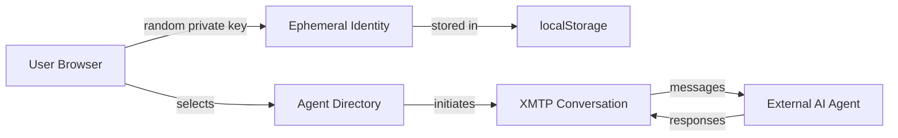

# XMTP Browser SDK Refactoring Plan

## Overview

Transform the AI chatbot application into a pure XMTP messaging client that communicates with external AI agents using ephemeral identities. No database, no authentication, no local AI models.

## Architecture Changes



## Phase 1: Install Dependencies

### Add XMTP Dependencies

- Install `@xmtp/browser-sdk@^0.0.6`
- Install `ethers@^6.13.4` for wallet management
- Run `yarn install`

### Remove Unused Dependencies

Remove from `package.json`:

- `ai`, `@ai-sdk/react`, `@ai-sdk/gateway`, `@ai-sdk/provider`
- `next-auth`
- `drizzle-orm`, `drizzle-kit`, `postgres`
- `bcrypt-ts`
- `redis`
- Artifact editing libs: `codemirror`, `@codemirror/*`, `prosemirror-*`, `react-data-grid`, `papaparse`
- `katex`, `streamdown` (CSS imports)

### Update Scripts

- Remove `db:*` scripts
- Update `build` script: remove `tsx lib/db/migrate &&`

## Phase 2: Create XMTP Infrastructure

### 1. Identity Management (`lib/xmtp/identity.ts`)

```typescript
// Generate random wallet using ethers
// Save/load private key from localStorage
// Get or create identity function
// Get wallet address helper
```

**Key Functions**:

- `generateRandomIdentity()`: `Wallet.createRandom()`
- `savePrivateKey(key: string)`: localStorage.setItem
- `loadPrivateKey()`: localStorage.getItem
- `getOrCreateIdentity()`: Load existing or create new
- `getWalletAddress(wallet)`: wallet.address

### 2. XMTP Client (`lib/xmtp/client.ts`)

```typescript
// Signer adapter for ethers Wallet
// Client creation with encryption key
// Conversation management
// Message sending/receiving
// Message streaming
```

**Key Functions**:

- `createXMTPSigner(wallet)`: Adapter for XMTP signer interface
- `createXMTPClient(wallet)`: `Client.create(signer, encryptionKey)`
- `startConversation(client, agentAddress)`: `(client.conversations as any).newDm(address)`
- `sendMessage(conversation, content)`: `conversation.send(content)`
- `getMessages(conversation)`: Sync + `conversation.messages()` with timestamp conversion
- `streamMessages(conversation, callback)`: `conversation.stream({ onValue })` with async cleanup

**Important Notes**:

- Use `type Dm = any` (SDK doesn't export types)
- Convert `sentAtNs` to Date: `new Date(Number(sentAtNs) / 1_000_000)`
- Return async cleanup: `async () => await stream.end()`
- Use `getBytes()` from ethers (not `hexToBytes`)

### 3. Agent Directory (`lib/xmtp/agents.ts`)

```typescript
// Define AIAgent type
// Export list of available agents
// Helper functions to get agent by address/id
```

**Structure**:

```typescript
type AIAgent = {
  id: string;
  name: string;
  description: string;
  address: string; // Ethereum address (0x + 40 hex chars)
};
```

## Phase 3: Remove Old Architecture

### Delete Authentication System

- Remove `app/(auth)/` folder entirely
- Remove `next-auth` dependency
- Remove auth-related imports from layouts

### Delete Database Layer

- Remove `lib/db/` folder (schema, queries, migrations, helpers)
- Remove `drizzle.config.ts`
- Remove database dependencies

### Delete AI System

- Remove `lib/ai/` folder (models, providers, prompts, tools)
- Remove AI SDK dependencies

### Delete Artifacts System

- Remove `lib/artifacts/` folder
- Remove `artifacts/` folder (if exists)
- Remove artifact-related components

### Delete API Routes

- Remove `app/(chat)/api/` folder entirely
- No backend API needed - everything is client-side XMTP

### Remove Unused Components

Delete:

- `components/artifact*.tsx`
- `components/*-editor.tsx` (code-editor, image-editor, etc.)
- `components/document*.tsx`
- `components/auth-form.tsx`, `sign-out-form.tsx`
- `components/app-sidebar.tsx`, `sidebar-*.tsx`
- `components/data-stream-*.tsx`
- `components/message-editor.tsx`
- `components/toolbar.tsx`, `weather.tsx`
- `components/visibility-selector.tsx` (no DB visibility)
- `components/suggested-actions.tsx`
- `components/message-reasoning.tsx`
- `components/ai-elements/` folder
- `components/elements/` folder (if artifact-related)

### Remove Unused Hooks

Delete:

- `hooks/use-artifact.ts`
- `hooks/use-chat-visibility.ts`
- `hooks/use-auto-resume.ts`
- `hooks/use-messages.tsx` (if using XMTP messages instead)

## Phase 4: Build New UI

### 1. Agent Selector Component (`components/agent-selector.tsx`)

```typescript
// Display grid of available agents from lib/xmtp/agents.ts
// Show name, description, address
// Click to select agent
// Card-based UI
```

### 2. Refactor Chat Component (`components/chat.tsx`)

**Remove**:

- `useChat` from `@ai-sdk/react`
- AI SDK imports
- Model selection
- Visibility controls
- Votes, artifacts, tools

**Add**:

- XMTP client prop
- Agent prop
- User address prop
- XMTP message state
- Conversation ref (type `Dm = any`)
- useEffect for conversation initialization
- Message streaming with proper cleanup
- Send message handler

**Key Pattern**:

```typescript
useEffect(() => {
  let cleanup: (() => Promise<void>) | null = null;

  const initConversation = async () => {
    const conversation = await startConversation(client, agent.address);
    const messages = await getMessages(conversation);
    setMessages(messages);

    cleanup = await streamMessages(conversation, (msg) => {
      setMessages((prev) => [...prev, msg]);
    });
  };

  initConversation();

  return () => {
    if (cleanup) cleanup();
  };
}, [client, agent]);
```

### 3. Simplify Messages Component (`components/messages.tsx`)

**Remove**:

- Artifact rendering
- Tool calls
- Reasoning displays
- Citations
- Complex message parts

**Keep**:

- Plain text message display
- Sender identification (user vs agent)
- Timestamps
- Scroll area

### 4. Simplify Input Component (`components/multimodal-input.tsx`)

**Remove**:

- File attachments
- Model selector
- Complex input modes

**Keep**:

- Text textarea
- Send button
- Enter key handling
- Loading state

### 5. Update Chat Header (`components/chat-header.tsx`)

**Remove**:

- Model selector
- Visibility selector
- Complex controls

**Add**:

- Agent name/description
- "Back to Agents" button

### 6. Update Main Page (`app/(chat)/page.tsx`)

**Remove**:

- Auth checks
- Database chat ID generation
- Cookie-based model selection

**Add**:

- Client-side component ("use client")
- XMTP client initialization
- Ephemeral identity management
- Agent selector display
- Chat view when agent selected
- Wallet address display
- "Generate New Identity" button

**Structure**:

```typescript
"use client";

export default function Page() {
  const [client, setClient] = useState<Client | null>(null);
  const [selectedAgent, setSelectedAgent] = useState<AIAgent | null>(null);
  const [walletAddress, setWalletAddress] = useState<string>("");

  useEffect(() => {
    const wallet = getOrCreateIdentity();
    setWalletAddress(getWalletAddress(wallet));
    createXMTPClient(wallet).then(setClient);
  }, []);

  // Show agent selector or chat based on state
}
```

### 7. Update Layouts

**`app/(chat)/layout.tsx`**:

- Remove auth checks
- Simple wrapper div

**`app/layout.tsx`**:

- Remove `SessionProvider` from next-auth
- Keep `ThemeProvider` and `Toaster`
- Update metadata

## Phase 5: Clean Up

### Update Types (`lib/types.ts`)

**Remove**:

- `ChatMessage` with AI SDK types
- `Attachment` type
- `VisibilityType` (if DB-related)
- All AI/DB-related types

**Keep/Add**:

```typescript
export type XMTPMessage = {
  id: string;
  content: string;
  senderAddress: string; // Actually senderInboxId
  sentAt: Date;
};
```

### Update Utils (`lib/utils.ts`)

**Remove**:

- `fetcher`, `fetchWithErrorHandlers`
- `convertToUIMessages`
- `getTextFromMessage`
- All DB/AI utilities

**Keep**:

- `cn()` for className merging
- `generateUUID()` for IDs

### Update Next Config (`next.config.ts`)

```typescript
const nextConfig: NextConfig = {
  cacheComponents: true,
  turbopack: {}, // Enable Turbopack for WASM support
};
```

### Clean Up CSS (`app/globals.css`)

**Remove**:

- `@import "katex/dist/katex.min.css";`
- `@source '../node_modules/streamdown/dist/index.js';`
- `@plugin "@tailwindcss/typography";` (if not needed)

### Fix UI Component Imports

Update all `components/ui/*.tsx` files:

- Change `from "radix-ui"` to `from "@radix-ui/react-*"`
- Fix button component: `SlotPrimitive` instead of `SlotPrimitive.Slot`

### Remove Unused Files

- `lib/constants.ts` (if DB-related)
- `lib/errors.ts` (if AI SDK-related)
- `lib/editor/` folder
- `instrumentation.ts` (OpenTelemetry)
- `proxy.ts`
- `components.json` (if unused)
- Test files in `tests/` (will need rewriting)

## Phase 6: Implementation Details

### Client Creation Pattern

```typescript
const signer = {
  getAddress: async () => wallet.address,
  signMessage: async (message: string) => {
    const signature = await wallet.signMessage(message);
    return getBytes(signature); // ethers v6
  },
};

const encryptionKey = new Uint8Array(32);
const client = await Client.create(signer, encryptionKey);
```

### Conversation Pattern

```typescript
// Direct address, lowercase
const dm = await(client.conversations as any).newDm(agentAddress.toLowerCase());
```

### Message Pattern

```typescript
// Sync first
await conversation.sync();

// Get messages
const messages = await conversation.messages();

// Convert timestamps
sentAt: new Date(Number(msg.sentAtNs) / 1_000_000);
```

### Streaming Pattern

```typescript
const stream = await conversation.stream({
  onValue: (message) => {
    // Handle message
  },
});

// Cleanup
return async () => {
  await stream.end();
};
```

## Testing Checklist

1. ✅ Build passes (`yarn build`)
2. ✅ No TypeScript errors
3. ✅ No linting errors
4. ✅ Dev server starts (`yarn dev`)
5. ✅ Ephemeral identity created on first visit
6. ✅ Identity persists in localStorage
7. ✅ Agent selector displays
8. ✅ Can select agent
9. ✅ XMTP client initializes
10. ✅ Conversation starts
11. ✅ Messages sync
12. ✅ Can send message
13. ✅ Messages stream in real-time
14. ✅ Cleanup works on unmount

## Known Issues & Solutions

### Type Exports

- **Issue**: SDK doesn't export `Dm`, `Conversation` types
- **Solution**: Use `type Dm = any;` with comments

### API Differences

- **Issue**: Documentation methods don't exist
- **Solution**: Use `(client.conversations as any).newDm()` with type casting

### Timestamp Conversion

- **Issue**: Messages use nanoseconds, not milliseconds
- **Solution**: `new Date(Number(sentAtNs) / 1_000_000)`

### Cleanup

- **Issue**: Stream cleanup must be async
- **Solution**: Return `async () => await stream.end()`

## Environment Setup

Create `.env.local`:

```env
# Optional: XMTP network (handled by SDK defaults)
# NEXT_PUBLIC_XMTP_ENV=dev
```

## Final Result

A lightweight XMTP messaging client that:

- ✅ Generates ephemeral wallet identities
- ✅ Stores identity in localStorage
- ✅ Displays list of AI agents
- ✅ Creates XMTP conversations with agents
- ✅ Sends/receives plain text messages
- ✅ Streams messages in real-time
- ✅ No database, no auth, no local AI
- ✅ Fully client-side
